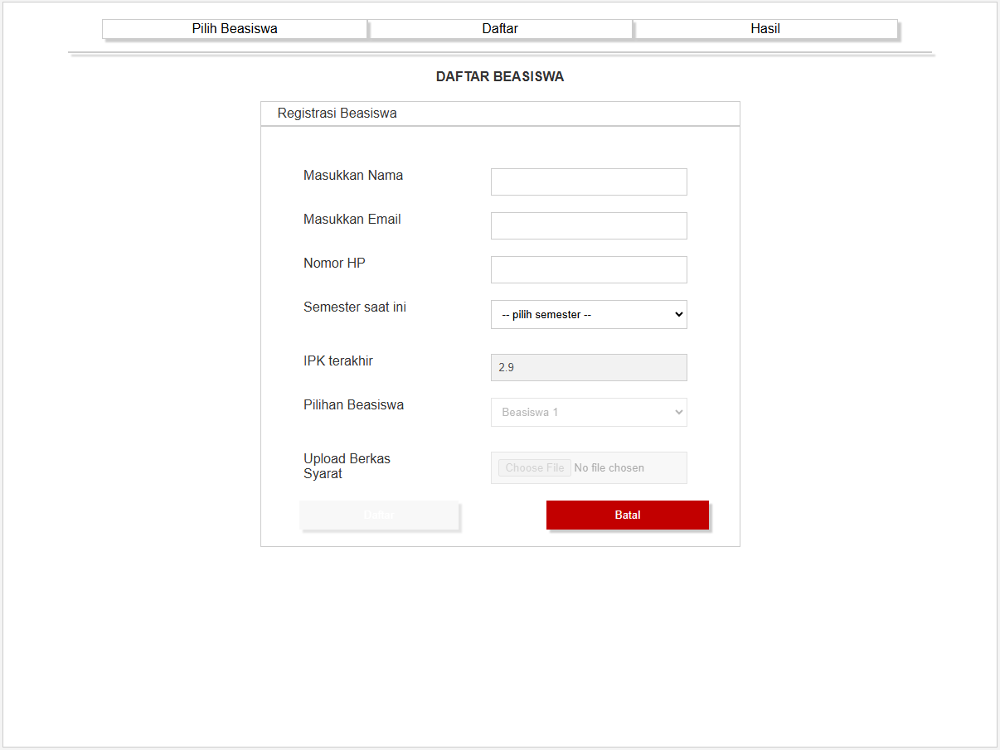
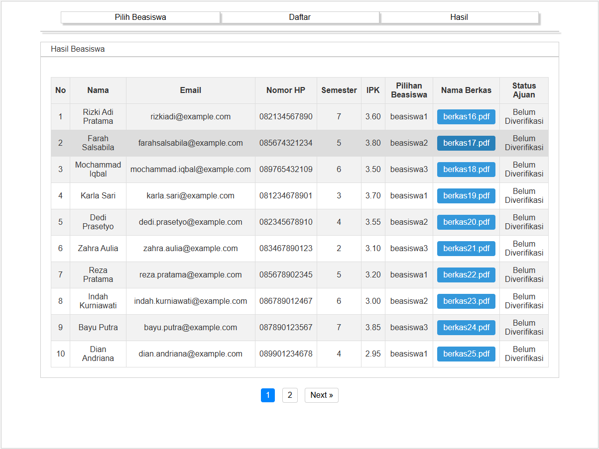
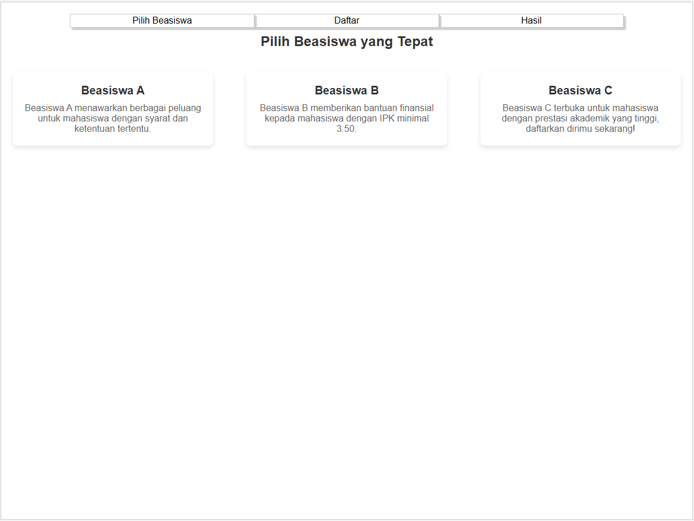

# Daftar Beasiswa

**Nama : Defbi Anisto**
**NIM  : 21103139**

## Deskripsi Proyek
Proyek ini adalah aplikasi berbasis web untuk mempermudah proses pendaftaran dan pengelolaan beasiswa. Pengguna dapat memilih beasiswa yang diinginkan, mengisi formulir pendaftaran, dan mengunggah dokumen pendukung sesuai dengan persyaratan.

- **Tampilan Register Beasiswa**



- **Tampilan Hasil Beasiswa**



- **Tampilan Pilih Beasiswa**




## Fitur Utama
1. **Halaman Pilihan Beasiswa**: Pengguna dapat melihat daftar beasiswa yang tersedia beserta deskripsi singkatnya.
2. **Formulir Pendaftaran**: Pengguna dapat mendaftar dengan memasukkan data seperti nama, email, nomor HP, semester, dan IPK, serta mengunggah berkas persyaratan.
3. **Validasi Data**: Sistem melakukan validasi data, termasuk format email, panjang nomor HP, dan jenis file yang diunggah.
4. **Penyimpanan Data**: Data yang valid akan disimpan ke dalam basis data MySQL.
5. **Pesan Kesalahan dan Sukses**: Menampilkan pesan kesalahan atau sukses kepada pengguna untuk setiap tindakan yang dilakukan.
6. **Responsive Design**: Desain antarmuka yang responsif sehingga dapat digunakan di berbagai perangkat.

## Struktur Proyek
- **index.php**: Halaman utama untuk pendaftaran beasiswa.
- **pilih-beasiswa.php**: Halaman untuk menampilkan daftar beasiswa yang tersedia.
- **upload.php**: Skrip backend untuk memproses pendaftaran dan menyimpan data ke basis data.
- **conn.php**: Skrip koneksi ke database MySQL.
- **style.css**: File gaya untuk mempercantik antarmuka pengguna.

## Persyaratan Sistem
- Web server seperti Apache atau Nginx.
- PHP versi 7.4 atau lebih baru.
- MySQL sebagai basis data.
- Browser modern untuk mengakses antarmuka.

## Instalasi
1. Clone atau unduh repository ini.
2. Letakkan file di dalam folder server lokal Anda (misalnya, `htdocs` jika menggunakan XAMPP).
3. Impor file SQL yang diperlukan ke dalam basis data MySQL. Pastikan nama database adalah `db_beasiswa` atau sesuaikan dengan pengaturan di `conn.php`.
4. Jalankan server lokal Anda, lalu buka `http://localhost/nama-folder/index.php` di browser.

## Konfigurasi Database
File `conn.php` digunakan untuk mengatur koneksi ke database. Berikut adalah contoh konfigurasi:
```php
$host = "localhost";
$username = "root";
$password = "";
$dbname = "db_beasiswa";
```
Sesuaikan nilai `$username`, `$password`, dan `$dbname` sesuai dengan pengaturan database Anda.

## Catatan Penting
- Pastikan folder `berkas` memiliki izin tulis agar dapat menyimpan file yang diunggah.
- File yang diunggah hanya mendukung format `pdf`, `jpg`, `jpeg`, `png`, atau `zip`.
- IPK dihitung secara otomatis berdasarkan semester yang dipilih.

## Penggunaan
1. Buka halaman `pilih-beasiswa.php` untuk melihat daftar beasiswa.
2. Navigasikan ke `index.php` untuk mendaftar beasiswa.
3. Isi formulir pendaftaran dan unggah dokumen yang diminta.
4. Setelah berhasil, data akan disimpan dan dapat diverifikasi lebih lanjut.

## Kontribusi
Jika Anda ingin berkontribusi untuk meningkatkan proyek ini, silakan kirimkan pull request atau laporkan masalah melalui [issue tracker](#).

## Lisensi
Proyek ini dilisensikan di bawah [lisensi MIT](LICENSE).

